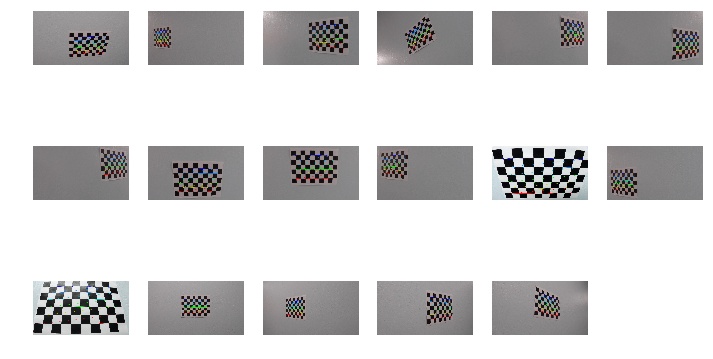
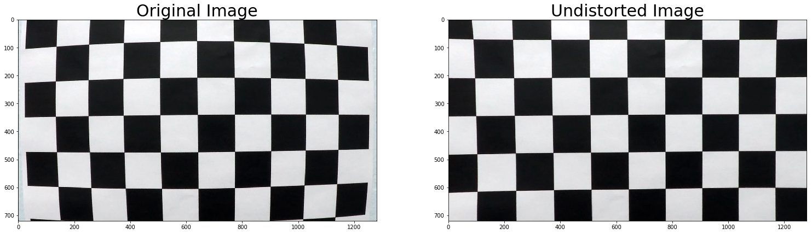
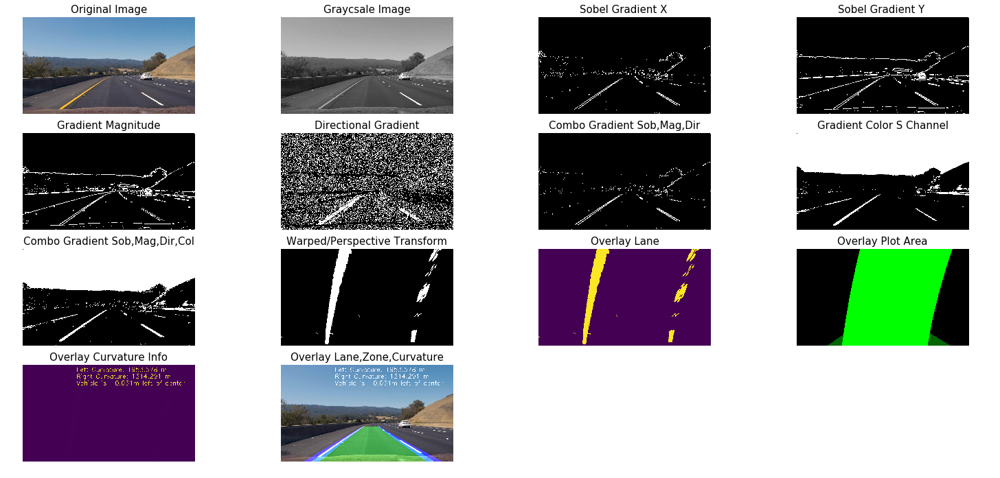
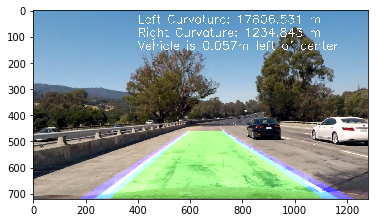
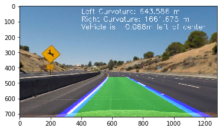
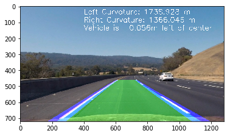
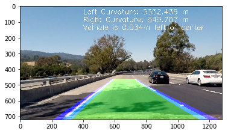
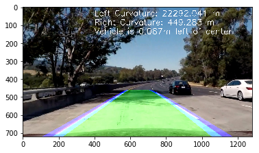
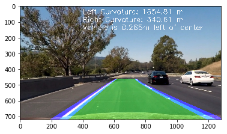

#Advanced Lane Detection

##Objective:

In this project, my goal is to write a software pipeline to identify the
lane boundaries in a video. To achieve the same, below is high level
outline of steps which are required to be performed.

1.  Compute the camera calibration matrix and distortion coefficients
    given a set of chessboard images.

2.  Apply a distortion correction to raw images.


3.  Use color transforms, gradients (Sobel, Magnitude, Directional), to
    create a threshold binary image.


4.  Apply a perspective transform to rectify binary image ("birds-eye
    view").

5.  Detect lane pixels and fit to find the lane boundary.


6.  Determine the curvature of the lane and vehicle position with
    respect to center.


7.  Warp the detected lane boundaries back onto the original image.

8.  
Output visual display of the lane boundaries and numerical
    estimation of lane curvature and vehicle position.

9.  Test Pipeline on Test Images & Videos.

##Detailed Solution:

I wrote all the steps articulated below as helper functions in Cell
58, code file “Advance Lane Detection.ipynb”. Post defining helper
functions, I created pipeline which will be further used for
processing videos and test images.

###1. Camera Calibration:

The code for this step is contained in the Cell 1 & 2 of code file
“Advance Lane Detection.ipynb”

I start by preparing "object points", which will be the (x, y, z)
coordinates of the chessboard corners in the world. Here I am assuming
the chessboard is fixed on the (x, y) plane at z=0, such that the
object points are the same for each calibration image. Thus, objp is
just a replicated array of coordinates, and objpoints will be appended
with a copy of it every time I successfully detect all chessboard
corners in a test image.

imgpoints will be appended with the (x, y) pixel position of each of
the corners in the image plane with each successful chessboard
detection.

Sample of corner’s detection as demonstrated below:

###2. Distortion Correction:

I then used the output objpoints and imgpoints to compute the camera
calibration and distortion coefficients using the cv2.calibrateCamera()
function. I applied this distortion correction to the test image using
the cv2.undistort() function and obtained this result:

This result is show in Cell#: 64

###3. Gradient (Sobel, Magnitude & Directional):

Instead of applying Canny Edge detection, we will rather make use of
Sobel Function to be applied separately on X, Y Orientations, further
apply Magnitude, Directional Gradients & Color transformations all
blended to yield better lane detection.

Following OpenCV, Numpy Libraries were to used:

**Sobel** -&gt; cv2.Sobel()

**Magnitude** -&gt; abs\_sobelxy=√​(sobel​x​​)​2​​+(sobel​y​​)​2​​​​​
(Achieved with numpy)

**Directional** -&gt; arctan(sobel​y​​/sobel​x​​) (Achieved with numpy)

**Color Transform** -&gt; cv2.cvtColor(image, cv2.COLOR\_RGB2HLS),
playing with S Channel only, as this has been giving the best output
identifying lanes.

Samples Images for Step 3 are show below.

###4. Perspective Transform (Bird’s Eye View):

OpenCV’s utility cv2.getPerspectiveTransform has been used to achieve
this step. Tricky portion here is to identify right source and target
coordinates to achieve the desired result. I tried experimenting with
many hard-coded values achieving desired results, however, this was not
the ideal approach and had issues with different samples. Later, I used
supplied logic from Rubrics to dynamically identify coordinates and that
helped resolve this issue.

Samples Images for Step 4 are show below.

###5. Lane Finding:

Once we have Gradient Optimized & Perspective Transformed Image, we are
ready to identify Lane’s in the given Image.

We used histogram to identify peak i.e. left and right lanes, in lower
half of the image. Once we have identified, left and right x,y
coordinates, we use sliding window approach to progress identifying set
of left and right adjacent windows, giving us pixel positions defining
left and right windows with encapsulating lane x,y indices/coordinates
for each lane.

Samples Images for Step 5 are show below.

###6. Ploy-fit:

Indices from ‘Lane Finding’ are used to poly-fit (numpy) which in-turn
help identify coefficients for polynomial which are best fit (in least
squared sense). This step gives us relevant plot area, or on other words
safe-zone to have car be driven.

Samples Images for Step 6 are show below.

###7. Lane Curvature:

Identified lane-zone are in pixels space, we need to apply the
real-world space – with assumption of lane as 30 meters long and 3.7
meters wide for this project, we can derive lane curvatures using numpy
poly-fit factoring real-world space adjustments.

Samples Images for Step 7 are show below.

###8. Visualization:

At this stage, we have image transformed, lane-zone identified and
lane-curvatures identified with real-world spacing, as last stretch, we
will generate masked layers plotting lanes, lane-zone, and curvature
information and blend it over original image. It is crucial to remember
at this stage to apply inverse of perspective transform to have the
output be a good match.

I specifically differentiated lanes from lane-zone to better visual
clarity.

##Testing Helper Functions:

I attempted to capture output of each stage, such that I can minutely
understand if each helper function with subsequent kernel, threshold
values are giving us desired output prior running it on test-images.

##Results of tests as below:

##Pipeline:

At this stage, all the results look very promising – so I defined
pipeline combing all above steps in mentioned sequence to process one
image as input.

Cell 59 in code file demonstrates the same.

##Run Pipeline on Test Images:

Nothing special here, we just enumerate all samples images with
different scenarios being addressed and process them one by one. Results 
as shown below.

##Run Pipeline on Project & Challenge Videos:

##Project Video: 

Project video ran smooth at first go itself, there
was minor line jump in only one frame, otherwise it was relatively on
part with expectations.

##Challenge Video:

There are many tricky challenges here, I have not
yet completed this challenge, however, my thought process is to crop
area of interest and applying smoothing i.e. leveraging last ‘n’ frames
of video should help get better result.

##Hard-Challenge Video:

I have not attempted this yet, results of
challenge video will dictate further course of action.
